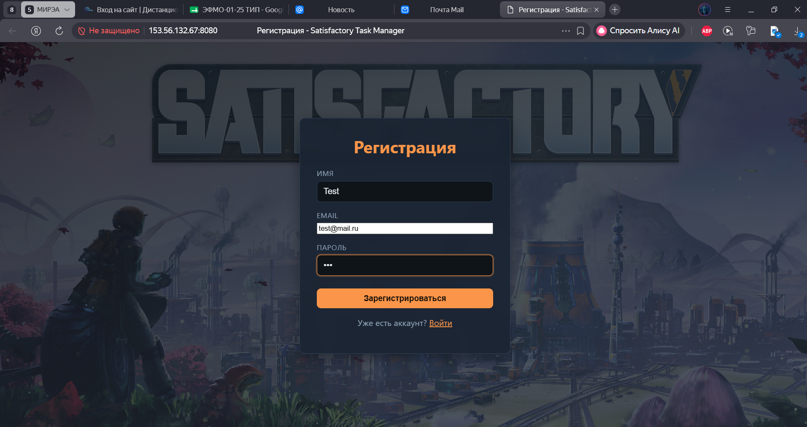

# Test-KR2 — Satisfactory Task Manager

Микросервисное веб-приложение на **Go** для координации производственных задач в игре **Satisfactory**: JWT-авторизация, рецепты v1.0, производственный план, NGINX-балансировка, Redis, RabbitMQ, Prometheus/Grafana.

**Код приложения:** [`satiafactory-task-manager/`](satiafactory-task-manager/)

## Быстрый старт

```bash
cd satiafactory-task-manager
docker compose -f docker-compose.balance.yml up -d --build
```

Приложение: **http://localhost:8080**

Полная документация, архитектура, нагрузочные тесты и деплой — в [README проекта](satiafactory-task-manager/README.md).

## Стек

Go · PostgreSQL · Docker Compose · NGINX · Redis · RabbitMQ · Prometheus · Grafana

## Демо

Схема архитектуры: [satiafactory-task-manager/docx/diagram_architecture.png](satiafactory-task-manager/docx/diagram_architecture.png)

## Демонстрация работы

### 1.	Регистрация



### 2. Вход


### 3.	Создание задачи


После входа пользователь переходит к списку задач. Доступны вкладки «Задачи команды», «Свои задачи», «Выполненные», поиск и пагинация.
При создании задачи пользователь выбирает рецепт Satisfactory, указывает целевую производительность и параметры производства. При повторных запросах списка задач заголовок X-Cache принимает значение HIT; заголовок X-Instance-ID чередуется между tasks-1, tasks-2, tasks-3

### 4. Просмотр задачи


Пользователь может посмотреть рецепт задачи просто развернув вкладку, также можно посмотреть “обратный рецепт”, чтобы было легче начать выполнение задачи с самого начала.

### 5. Смена статусов


Пользователь может назначить задачу на любого зарегистрированного игрока, все имена отображаются при нажатии на вкладку “—Не назначено—", там выбирается никнейм. После этого задача передается назначенному игроку. 
Пользователь, которому дали задачу, может менять статус, их всего три: “Ожидание”, “В работе”, “Выполнено”.

### 6. Смена фильтров и параметров


Пользователь может указать в “План производства” некоторые параметры, которые повлияют на рецепт и количество ресурсов для затрат на производство. Параметров всего три: “Энергомодулей в наличии”,  “Конвейерная лента”, “Трубы (жидкости)”.
От энергомодулей зависит ускорения производства определенного элемента в рецепте, что сильно ускоряет производство.
Чем выше уровень конвейерной ленты, тем больше ресурсов сможет по ним передвигаться.
Трубы работают аналогично конвейерным лентам.

### 7. Подробный просмотр рецепта


При подробном просмотре рецепта пользователь видит все что нужно для выполнения задачи. Чем сложнее рецепт, тем больше нужно элементов для его выполнения. Открывая рецепт задачи, игрок натыкается на ещё одни элементы, которые тоже надо производить. Для этого можно создать ещё одну задачу. Таким образом для выполнения одной задачи пользователь может создать очень много задач, что сильно нагрузит систему и появится много лишнего мусора.
Для решения данной проблемы была сделана “Матрёшка рецептов”. Открываю рецепт, ты сразу можешь посмотреть рецепт других элементов, надо просто нажать на него. После выполнения элемента, игрок может нажать на кнопку “Выполнено”, в интерфейсе данный элемент будет светиться зелёным, давая понять, что данная подзадача выполнена. Так пользователь сможет постепенно подбираться к выполнению основной поставленной задачи, не создавая спам и не нагружая систему.

### 8. Просмотр ресурсов для всех затрат


