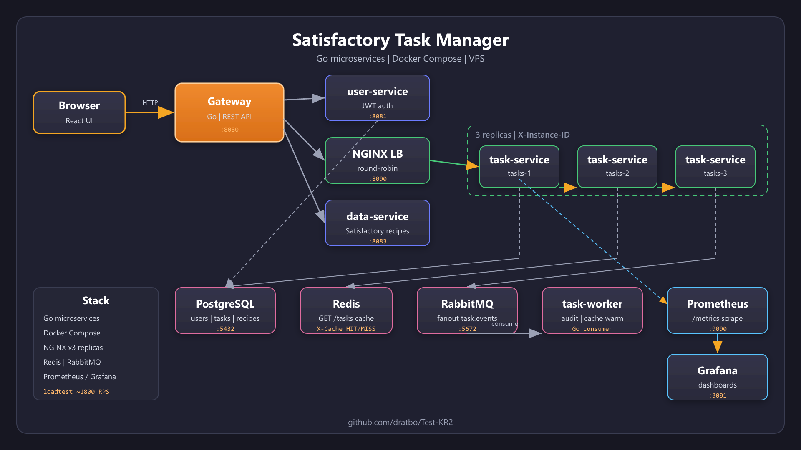

# Satisfactory Task Manager

Микросервисное веб-приложение на **Go** для координации производственных задач в кооперативной игре [Satisfactory](https://www.satisfactorygame.com): регистрация, задачи по рецептам игры, расчёт производственного плана, горизонтальное масштабирование, кэш, очереди и мониторинг.

**Репозиторий:** [github.com/dratbo/Test-KR2](https://github.com/dratbo/Test-KR2)



## Возможности

- Регистрация и вход (JWT в HttpOnly cookie)
- Создание задач с привязкой к рецептам Satisfactory v1.0 (поиск, превью, расчёт ресурсов)
- Командные задачи, личные задачи, выполненные; назначение исполнителя и смена статусов
- Производственный план: постройки, энергомодули, логистика, цепочки рецептов
- **3 реплики** `task-service` за **NGINX** (round-robin, заголовок `X-Instance-ID`)
- **Redis** — кэш списков задач (`X-Cache: HIT/MISS`)
- **RabbitMQ** + **task-worker** — события задач, audit-лог, прогрев кэша
- **Prometheus** + **Grafana** — метрики HTTP, кэша и реплик
- Деплой на VPS через Docker Compose

## Стек

| Компонент | Технологии |
|-----------|------------|
| Backend | Go, chi, JWT, pgx, HTML templates |
| Данные | PostgreSQL 15 |
| Инфраструктура | Docker Compose, NGINX, Redis, RabbitMQ |
| Наблюдаемость | Prometheus, Grafana |
| Игровые данные | [SatisfactoryTools](https://github.com/greeny/SatisfactoryTools) → `game-data.json` |

## Архитектура

```
Браузер → gateway:8080 → user-service:8081 (auth, JWT)
                      → nginx:8090 → task-service-1|2|3:8082
                      → satisfactory-data-service:8083 (рецепты)
                      → postgres:5432
                      → redis:6379 (кэш GET /tasks)
                      → rabbitmq:5672 → task-worker
Prometheus :9090 ← /metrics сервисов    Grafana :3001
```

| Сервис | Порт (хост) | Назначение |
|--------|-------------|------------|
| gateway | 8080 | UI и API-шлюз |
| user-service | 8081 | Пользователи, JWT |
| nginx | 8090 | Балансировка task-service |
| task-service ×3 | — | CRUD задач, кэш, события |
| satisfactory-data-service | 8083 | Импорт рецептов и предметов |
| postgres | 5432 | БД |
| redis | 6379 | Кэш списков |
| rabbitmq | 5672 / 15672 | Очередь событий / UI |
| prometheus | 9090 | Метрики |
| grafana | 3001 | Дашборды |

## Быстрый старт

### Требования

- Docker и Docker Compose v2
- Свободные порты: **8080**, **8081**, **5432**, **8090** (и **9090**, **3001**, **6379**, **5672** для полного стека)

### Запуск (рекомендуемый режим)

```bash
git clone https://github.com/dratbo/Test-KR2.git
cd Test-KR2/satiafactory-task-manager

docker compose -f docker-compose.balance.yml up -d --build
```

Приложение: **http://localhost:8080**

### Файлы Docker Compose

| Файл | Назначение |
|------|------------|
| `docker-compose.balance.yml` | Полный стек: 3× task-service, NGINX, Redis, RabbitMQ, мониторинг |
| `docker-compose.minimal.yml` | Отладка: один task-service, без NGINX |
| `docker-compose.yml` | Базовый стек без Redis/RabbitMQ/мониторинга |
| `docker-compose.vps.yml` | Продакшен-профиль для VPS |
| `docker-compose.https.yml` | Caddy reverse proxy (HTTPS) |
| `docker-compose.cloudflare.yml` | Cloudflare Tunnel |

Не запускайте `minimal` и `balance` одновременно — перед сменой режима остановите старые контейнеры.

### Сброс базы данных

Если схема БД устарела после обновления кода:

```bash
docker compose -f docker-compose.balance.yml down -v
docker compose -f docker-compose.balance.yml up -d --build
```

Флаг `-v` удаляет volume `postgres_data`; данные будут созданы заново (init-скрипты и миграции).

## Проверка балансировки

После входа откройте DevTools → Network и несколько раз обновите список задач. В ответах на `GET /tasks` заголовок **X-Instance-ID** должен чередоваться: `tasks-1`, `tasks-2`, `tasks-3`.

```bash
docker logs nginx-lb --tail 20
docker compose -f docker-compose.balance.yml ps
```

## Redis-кэш

`task-service` кэширует `GET /tasks` в Redis (общий для всех реплик):

| Scope | Ключ |
|-------|------|
| все активные | `tasks:list:all` |
| свои | `tasks:list:mine:{userID}` |
| выполненные | `tasks:list:completed` |

- TTL: **60 с** (`REDIS_CACHE_TTL`)
- Инвалидация при создании, изменении или удалении задачи
- Заголовок ответа: **`X-Cache: HIT`** или **`MISS`**

```bash
docker exec redis redis-cli KEYS "tasks:list:*"
docker logs task-service-1 --tail 5
```

## RabbitMQ и task-worker

Fanout-exchange **`task.events`**: `task.created`, `task.updated`, `task.deleted`.

**task-worker** подписан на очередь `task.worker`:

1. Audit-лог (`docker logs task-worker`)
2. Сброс Redis-кэша списков
3. Прогрев кэша из PostgreSQL

Management UI: http://localhost:15672 (`guest` / `guest`)

## Prometheus и Grafana

| Метрика | Описание |
|---------|----------|
| `http_requests_total` | Счётчик запросов |
| `http_request_duration_seconds` | Латентность |
| `task_cache_hits_total` / `task_cache_misses_total` | Redis-кэш |
| `task_service_up` | Живость реплики (`INSTANCE_ID`) |

| URL | Назначение |
|-----|------------|
| http://localhost:9090 | Prometheus |
| http://localhost:3001 | Grafana (`admin` / `admin`) |

Дашборд **Satisfactory Task Manager** подключается автоматически (папка *Satisfactory*).

```bash
curl http://localhost:8080/metrics
curl http://localhost:9090/targets
```

## Нагрузочное тестирование

Утилита в `loadtest/loadtest.go` — параллельные запросы к `GET /tasks` с проверкой `X-Instance-ID` и `X-Cache`.

```bash
# Стек должен быть запущен (balance)
cd loadtest
go run loadtest.go -url http://localhost:8090 -n 2000 -c 50
```

Параметры: `-url` (NGINX или gateway), `-n` запросов, `-c` workers, `-warmup` прогрев кэша, `-cookie` для cookie JWT через gateway.

Пример результата на типовой конфигурации: **~1800 RPS**, равномерное распределение по репликам, рост доли cache HIT после warmup.

## Рецепты Satisfactory

Сервис `satisfactory-data-service` импортирует `services/satisfactory-data-service/data/game-data.json` (Satisfactory **v1.0**, [SatisfactoryTools](https://github.com/greeny/SatisfactoryTools)) в PostgreSQL.

Ручной переимпорт:

```bash
docker compose -f docker-compose.balance.yml run --rm satisfactory-data-service ./data-service -import
```

Поддерживается legacy-формат `Docs.json` (Update 8) через `DATA_FILE_PATH=./data/Docs.json`.

## Деплой

| Документ | Описание |
|----------|----------|
| [deploy/VPS.md](deploy/VPS.md) | VPS: git clone, `.env`, Docker Compose |
| [deploy/HTTPS.md](deploy/HTTPS.md) | HTTPS через Caddy |
| [deploy/CLOUDFLARE.md](deploy/CLOUDFLARE.md) | HTTPS через Cloudflare Tunnel |

```bash
git clone https://github.com/dratbo/Test-KR2.git /opt/satisfactory-task-manager
cd /opt/satisfactory-task-manager/satiafactory-task-manager
cp deploy/.env.example deploy/.env   # задайте пароли
docker compose -f docker-compose.vps.yml --env-file deploy/.env up -d --build
```

Рекомендуется VPS **4 GB RAM**. Снаружи открыт только порт UI (`GATEWAY_PORT`, по умолчанию **8080**).

## Структура проекта

```
satiafactory-task-manager/
├── services/
│   ├── gateway/                 # UI, BFF, прокси к сервисам
│   ├── user-service/            # Auth, JWT, избранные исполнители
│   ├── task-service/            # Задачи, Redis, RabbitMQ publisher
│   ├── task-worker/             # Consumer, audit, cache warm
│   └── satisfactory-data-service/
├── docker/                      # Prometheus, Grafana, init-db
├── deploy/                      # VPS, HTTPS, Cloudflare
├── loadtest/                    # Нагрузочный тест
├── docx/                        # Диаграммы (PNG), материалы для защиты
└── docker-compose.*.yml
```

## Локальный запуск без Docker

1. PostgreSQL с init-скриптами из `docker/init-db/`
2. Отдельно: `user-service`, `task-service` (с `INSTANCE_ID`), `gateway`
3. Переменные: `DATABASE_URL`, `JWT_SECRET`, `USER_SERVICE_URL`, `TASK_SERVICE_URL`

## Полезные команды

```bash
docker compose -f docker-compose.balance.yml logs -f gateway user-service nginx
docker compose -f docker-compose.balance.yml down
```
