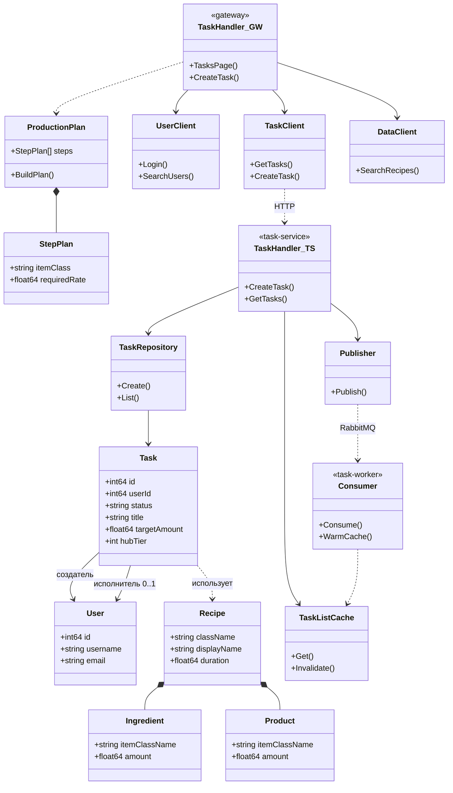

# Рисунок 2.2 — Диаграмма классов системы

**Готовый файл для draw.io:** [`diagram_class.drawio`](diagram_class.drawio) — откройте в [draw.io](https://app.diagrams.net/) (*File → Open from → Device*) и отредактируйте.

Ниже — текстовая спецификация (справочно).  
Тема курсовой: **Satisfactory Task Manager**.

## Рекомендуемая компоновка

Разместите классы в **четырёх блоках** (пакетах / swimlane):

| Блок | Подпись на диаграмме | Классы |
|------|----------------------|--------|
| 1 | **Предметная область** | `User`, `Task`, `Recipe`, `Ingredient`, `Product`, `ProductionPlan`, `StepPlan` |
| 2 | **gateway** | `TaskHandler`, `UserClient`, `TaskClient`, `DataClient`, `TaskView` |
| 3 | **task-service** | `TaskHandler`, `TaskRepository`, `TaskListCache`, `Publisher` |
| 4 | **task-worker** | `Consumer` |

Стиль UML: прямоугольник класса = **имя** | **атрибуты** | **методы** (разделители горизонтальными линиями).

---

## 1. Предметная область

### User
*user-service*

| Атрибуты | Методы |
|----------|--------|
| `- id: int64` | |
| `- username: string` | |
| `- email: string` | |
| `- password: string` | |
| `- createdAt: time` | |

---

### Task
*task-service*

| Атрибуты | Методы |
|----------|--------|
| `- id: int64` | |
| `- userId: int64` | |
| `- assignedToUserId: int64?` | |
| `- title: string` | |
| `- description: string` | |
| `- status: string` | *(pending \| in_progress \| completed)* |
| `- createdAt: time` | |
| `- targetItemClassName: string` | |
| `- targetAmount: float64` | |
| `- hubTier: int` | |
| `- productionShards: int` | |
| `- conveyorMk: int` | |
| `- pipeMk: int` | |

---

### Recipe
*data-service*

| Атрибуты | Методы |
|----------|--------|
| `- className: string` | |
| `- displayName: string` | |
| `- displayNameRU: string` | |
| `- duration: float64` | |
| `- ingredients: Ingredient[]` | |
| `- products: Product[]` | |
| `- producedIn: string[]` | |

---

### Ingredient

| Атрибуты |
|----------|
| `- itemClassName: string` |
| `- amount: float64` |

---

### Product

| Атрибуты |
|----------|
| `- itemClassName: string` |
| `- amount: float64` |

---

### ProductionPlan
*агрегат расчёта в gateway*

| Атрибуты | Методы |
|----------|--------|
| `- steps: StepPlan[]` | `+ BuildPlan(input: PlanInput): StepPlan[]` |
| `- totalPowerMw: float64` | |

---

### StepPlan

| Атрибуты |
|----------|
| `- itemName: string` |
| `- itemClass: string` |
| `- buildingName: string` |
| `- requiredRate: float64` |
| `- totalItems: float64` |
| `- scenarios: Scenario[]` |
| `- chosen: Scenario` |

---

## 2. Сервис gateway

### TaskHandler

| Атрибуты | Методы |
|----------|--------|
| `- taskClient: TaskClient` | `+ TasksPage()` |
| `- userClient: UserClient` | `+ CreateTask()` |
| `- dataClient: DataClient` | `+ UpdateTask()` |
| `- tasksTmpl: Template` | `+ TaskDetail()` |

---

### UserClient

| Методы |
|--------|
| `+ Register()` |
| `+ Login()` |
| `+ SearchUsers()` |
| `+ GetFavorites()` |

---

### TaskClient

| Методы |
|--------|
| `+ GetTasks()` |
| `+ GetTask()` |
| `+ CreateTask()` |
| `+ UpdateTask()` |
| `+ DeleteTask()` |

---

### DataClient

| Методы |
|--------|
| `+ SearchRecipes()` |
| `+ GetRecipe()` |
| `+ GetItemIcon()` |

---

### TaskView
*DTO для HTML-шаблона*

| Атрибуты |
|----------|
| `- id, title, status, statusLabel` |
| `- targetAmount, recipeName` |
| `- creatorName, assigneeName` |
| `- productionPlan: StepPlan` |

---

## 3. Сервис task-service

### TaskHandler

| Атрибуты | Методы |
|----------|--------|
| `- repo: TaskRepository` | `+ CreateTask()` |
| `- cache: TaskListCache` | `+ GetTasks()` |
| `- publisher: Publisher` | `+ UpdateTask()` |
| | `+ DeleteTask()` |

---

### TaskRepository

| Атрибуты | Методы |
|----------|--------|
| `- db: DB` | `+ Create(task: Task)` |
| | `+ GetByID(id)` |
| | `+ List(scope, userId)` |
| | `+ Update(task)` |

---

### TaskListCache

| Атрибуты | Методы |
|----------|--------|
| `- rdb: Redis` | `+ Get(scope, userId)` |
| `- ttl: Duration` | `+ Set(scope, userId, data)` |
| | `+ Invalidate(scope, userId)` |

---

### Publisher

| Атрибуты | Методы |
|----------|--------|
| `- channel: AMQPChannel` | `+ Publish(event: TaskEvent)` |

---

## 4. Сервис task-worker

### Consumer

| Атрибуты | Методы |
|----------|--------|
| `- repo: TaskRepository` | `+ Consume()` |
| `- cache: TaskListCache` | `+ WarmCache()` |

---

## Связи между классами

Ниже — связи для стрелок на диаграмме. Тип UML: ассоциация `───>`, агрегация `◇──`, композиция `◆──`.

| От | К | Тип | Подпись / кратность |
|----|---|-----|---------------------|
| `Task` | `User` | ассоциация | `создатель` — *1 |
| `Task` | `User` | ассоциация | `исполнитель` — 0..1 |
| `Task` | `Recipe` | зависимость | `использует рецепт` |
| `ProductionPlan` | `StepPlan` | композиция | `1..*` |
| `Recipe` | `Ingredient` | композиция | `1..*` |
| `Recipe` | `Product` | композиция | `1..*` |
| `TaskHandler` (gateway) | `TaskClient` | ассоциация | |
| `TaskHandler` (gateway) | `UserClient` | ассоциация | |
| `TaskHandler` (gateway) | `DataClient` | ассоциация | |
| `TaskHandler` (gateway) | `ProductionPlan` | зависимость | `расчёт плана` |
| `TaskHandler` (gateway) | `TaskView` | зависимость | `рендер` |
| `TaskClient` | `TaskHandler` (task-service) | зависимость | `HTTP/JSON` |
| `TaskHandler` (task-service) | `TaskRepository` | ассоциация | |
| `TaskHandler` (task-service) | `TaskListCache` | ассоциация | |
| `TaskHandler` (task-service) | `Publisher` | ассоциация | |
| `TaskRepository` | `Task` | ассоциация | `CRUD` |
| `Publisher` | `Consumer` | зависимость | `RabbitMQ: task.events` |
| `Consumer` | `TaskListCache` | зависимость | `invalidate / warm` |

---

## Схема связей (Mermaid — для ориентира)

Скопируйте в draw.io через *Arrange → Insert → Advanced → Mermaid* или используйте как эскиз.

---

## Подпись рисунка в отчёте

**Рисунок 2.2 – Диаграмма классов системы**

## Примечания для draw.io

1. Два класса `TaskHandler` лучше подписать: **TaskHandler** *(gateway)* и **TaskHandler** *(task-service)* — это разные классы в разных сервисах.
2. Блок «Предметная область» разместите сверху; инфраструктурные клиенты и репозитории — ниже.
3. Связь `TaskClient` → `TaskHandler (task-service)` можно обозначить пунктиром с подписью **HTTP/JSON**.
4. Связь `Publisher` → `Consumer` — пунктир, подпись **RabbitMQ (task.events)**.
5. После экспорта из draw.io вставьте PNG в Word вместо автогенерируемого `diagram_class.png` или положите файл как `docx/diagram_class.png` и пересоберите отчёт.
